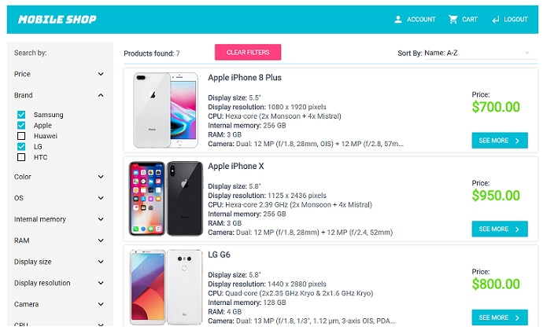

# MERN stack shopping cart



## Intro

I started working on this app a while ago when I was still learning technologies used in this project, so please be aware that
the codebase (and the whole app in general) isn't perfect and there is still room for improvement, even though I've updated the code multiple times over the past years.

So, consider this as a learning example or just a showcase rather than a production-quality code.

## Description

Shopping cart app build with MERN stack and using RESTful API design. Responsive front-end design done with Material-UI, uses
Redux for state management, Node & Express for API, MongoDB as database. App runs in Docker containers but you can also run each sub-app separately, without Docker.

You can get and view the list of all products from the API, register, add products to cart, remove specific product or empty entire cart, make order...

## Technologies & Tools

### Front-end:

* React
* Redux
* Redux-Saga
* Material-UI
* Webpack
* TypeScript

### Backend:

* Node/Express
* MongoDB/Mongoose

## Installation and Usage

### Requirements:

* Docker

In case you want to run it without Docker (requires additional setup):

* Node.js installed
* MongoDB connection

### Steps:
1. Clone repo on your local machine:
```
$ git clone https://github.com/ivan3123708/fullstack-shopping-cart.git
```
2. Run `docker-compose`
```
$ cd fullstack-shopping-cart
$ docker-compose up -d
```
This will pull images and build 3 containers for each part of the application: `frontent`, `backend` & `db`.

3. If everything went without problems, go to `localhost:3000`, you should see the running app.

- `frontend` container (React app) runs on port `3000`
- `backend` container (Node api) runs on port `5000`
- `db` container (MongoDB server) runs on port `27017`

Use `docker exec -it <container name> bash` to troubleshoot if there are any problems.
